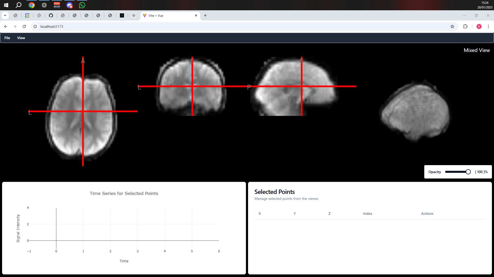
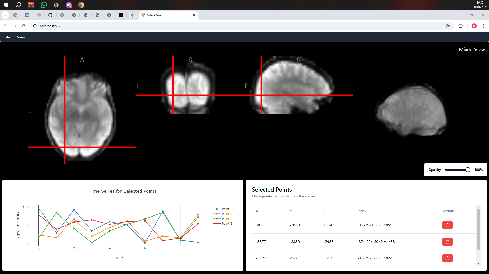
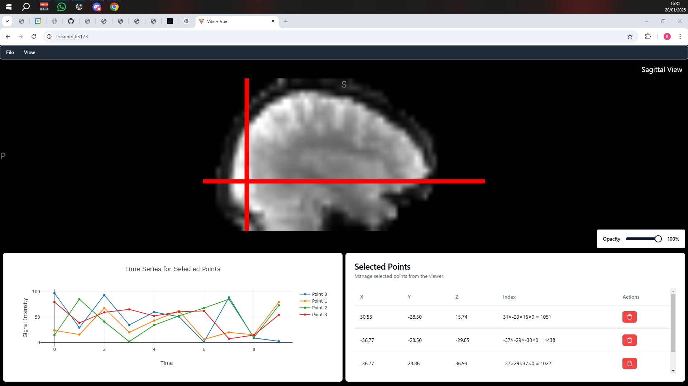
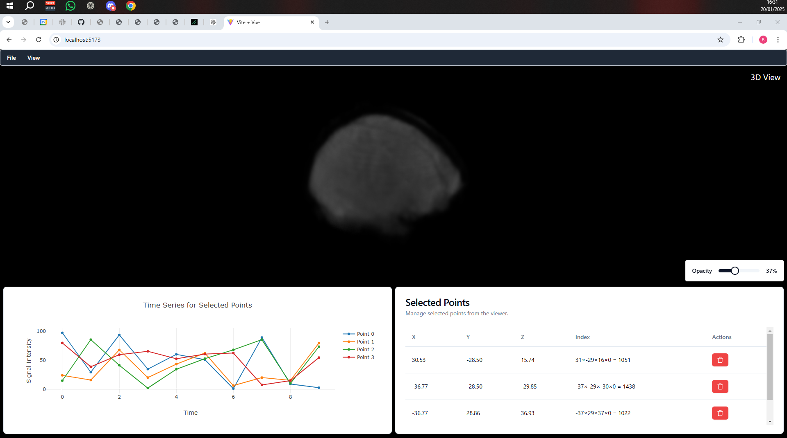

# Niivue 3D File Reader - Test task

The task was to create a simple 3D `.nii.gz` file viewer with Vue 3, Javascript, Niivue and Plotly.
It was decided that this was to be created with the stack defined below.

## Tech Stack

Frontend - `frontend-js`:

- Node v22.9.0
- Vue 3
- Javascript
- Plotly.js
- Niivue
- Shadcn/Vue (For layout and interface)

Backend:

- Python 3.12.8
- FastAPI
- Poetry 2.0.0

## How to run

You have to run two instances of your terminal to run this project, since you need both frontend and backend running on two different instances.
First of all, you need to make sure that you have both Node.js and Python 3 installed on your machine. The ones used on this project are:

- Node v22.9.0
- Python 3.12.8

But you can use Python from 3.10 and above, as well as Node from v20 and above. After making sure your machine has those two softwares installed, you need to clone this repository onto your PC with:

    > git clone https://github.com/BrunoDG/NiiVueReader

After cloning the repository, you will need to run some commands to make sure your program will install properly.

### Installing and running the Backend

To install and run the backend locally, you need to [install poetry first](https://python-poetry.org/docs/#installation). After installing Poetry, you need to run the command `poetry install`, to make sure it will install all project dependencies.
Before running the backend, you need to run the virtual environment for the backend. Poetry makes it easy to run as easy as to just run the command:

    > poetry env activate

After that, all you need to do is to run the command:

    > poetry run main

And your backend will be ready to go.

### Installing and running the Frontend

To install all components from the frontend, when you made sure you have node and npm installed on your machine, you can run `npm install`.
After npm finishes installing all dependencies, you can run

    > npm run dev 

and your frontend will be ready to go.

## Project Structure

Inside each folder, from `frontend` and `backend`, you can find more about each part's structures.

## Images

## Demo Video

If not available here, you can checkout at the folder `images/NiivueReader_ToolDemo.mp4` to see what the tool is capable of doing.
[(images/NiivueReader_ToolDemo.mp4)]
